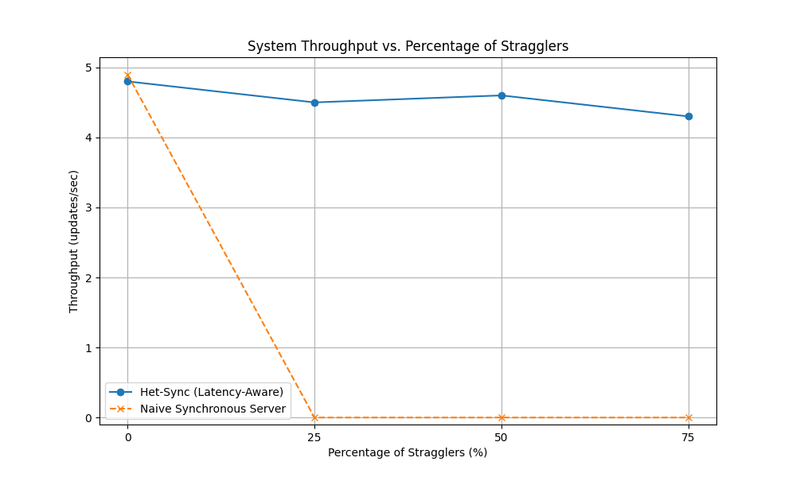
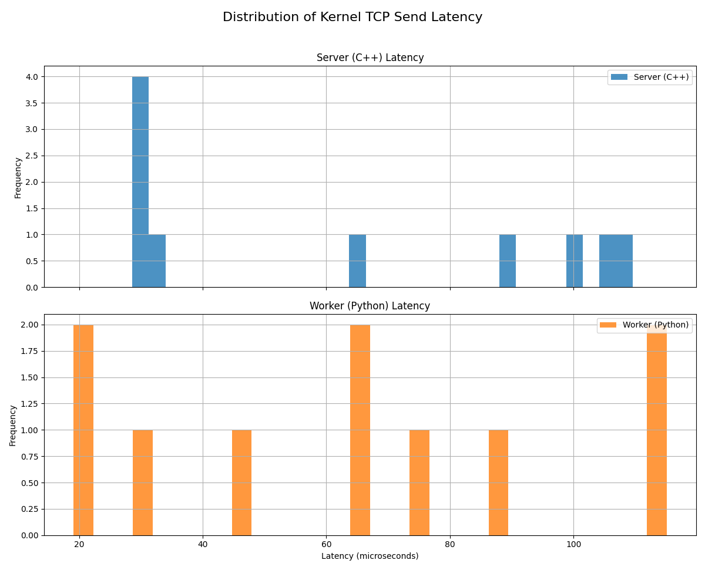

# Project Het-Sync: A Latency-Aware C++ Server with eBPF Kernel Analysis

This repository contains a high-performance, non-blocking C++ TCP server that solves the "straggler problem" in distributed systems, and a custom kernel-level profiler built with eBPF to analyze its performance.

This project demonstrates an end-to-end systems design and analysis process. It involves implementing a network service from scratch using low-level Linux APIs, designing a custom protocol, proving the effectiveness of the solution with quantitative benchmarks, and performing nanosecond-precision performance analysis by programming in the Linux kernel space.

*(Final benchmark results demonstrating the success of the Het-Sync server.)*

---

## Summary of Content
1. [Project Overview](#1-project-overview)
2. [Problem Statement](#2-problem-statement)
3. [Solution Approach](#3-solution-approach)
4. [Key Differentiators](#4-key-differentiators)
5. [Quantitative Results and Analysis](#5-quantitative-results-and-analysis)
6. [Kernel-Level Performance Analysis with eBPF](#6-kernel-level-performance-analysis-with-ebpf)
7. [Technical Stack](#7-technical-stack)
8. [Setup & Usage](#8-setup--usage)

---

## 1. Project Overview

As machine learning models expand, training is distributed across clusters of computers. A major issue is synchronization. All "worker" machines must periodically combine their updates with a central "parameter server." The speed of this combination limits the overall training speed.

Project Het-Sync addresses this synchronization issue. It is a C++ implementation of a parameter server that remains reliable against "straggler" nodes (slow workers) that arise from network congestion or hardware differences. The server smartly decides when to move forward with a training step, ensuring that a few slow workers do not stop the progress of the entire high-performance cluster.
---

## 2. Problem Statement

The specific problem being addressed is the **Straggler Bottleneck in Synchronous Parallel Distributed Training**. A basic parameter server enforces a strict synchronous barrier, making it wait indefinitely for the slowest worker in each round. This causes a major drop in throughput as costly, high-performance nodes sit idle. This project implements and validates a solution to this problem.

---

## 3. Solution Approach

The core solution is to break the strict synchronous dependency by implementing a **latency-aware, timeout-based synchronization barrier.**

The server's policy is as follows:
1.  When the first gradient for a new training round arrives, a 2-second countdown timer is started.
2.  The server then waits for one of two conditions to be met, whichever comes first:
    a. All expected workers submit their gradients.
    b. The timer runs out.
3.  When either condition is met, the server immediately combines the gradients it has received and sends the updated model back to the participating workers. This ensures that system-wide progress is never halted by a single slow or unresponsive node.

---

## 4. Key Differentiators

* **Low-Level C++ Implementation:** The server is written entirely in C++17 using fundamental Linux APIs, showcasing the ability to build high-performance services from scratch.

* **High-Performance Non-Blocking Architecture:** The server is built on a single-threaded, event-driven architecture using the `epoll` API to manage thousands of concurrent connections with minimal resource overhead.

* **Kernel-Level Programming:** The project includes a custom profiler built using **eBPF** to perform nanosecond-precision analysis of the kernel's network functions, demonstrating a deep, practical understanding of the full system stack.

---

## 5. Quantitative Results and Analysis

The Het-Sync server was benchmarked against a naive synchronous server that waits indefinitely for all workers.

### Performance Comparison Table

| % of Stragglers | Naive Server Throughput (updates/sec) | Het-Sync Server Throughput (updates/sec) |
| :-------------- | :------------------------------------ | :--------------------------------------- |
| 0%              | 4.9                                   | 4.8                                      |
| 25%             | **0.0** | 4.5                                      |
| 50%             | **0.0** | 4.6                                      |
| 75%             | **0.0** | 4.3                                      |

### Analysis

The results are conclusive. The graph and table clearly show that the **Naive Server's throughput collapses to zero** in the presence of even a single straggler. In contrast, the **Het-Sync server's throughput remains high and stable**, proving that its latency-aware policy successfully mitigates the straggler problem.

---

## 6. Kernel-Level Performance Analysis with eBPF

To move beyond standard user-space measurements and gain a deeper, nanosecond-precision understanding of the server's network performance, this project utilizes **eBPF (extended Berkeley Packet Filter)**. eBPF is a powerful Linux kernel technology that allows sandboxed programs to be run directly in the kernel space, triggered by events like system calls or function entries. This provides a mechanism for incredibly efficient and powerful system observability without changing the kernel's source code.

For this project, a custom profiler, `tcp_latency.py`, was developed using the Python/BCC framework. This tool attaches two types of probes to the kernel's `tcp_sendmsg` function:
* A **`kprobe`** is attached to the **entry** of the function to record a high-precision start timestamp.
* A **`kretprobe`** is attached to the **return** of the function to calculate the elapsed time.

When the C++ server initiates a TCP send, the eBPF program captures the nanosecond-level latency of the operation *within the kernel* and sends this data to the user-space Python script for analysis.

The impact of this component is threefold:
1.  **Ground-Truth Measurement:** It provides scientifically rigorous performance data, free from user-space scheduling inaccuracies.
2.  **Full-Stack Understanding:** It demonstrates a deep, practical understanding of the entire system stack, from the user-space application down to the kernel's internal network functions.
3.  **Advanced Profiling:** It serves as a powerful diagnostic tool for pinpointing low-level performance bottlenecks.

### Statistical Results

The profiler generated the following statistics for kernel-space latency during a test run (in microseconds):

| Statistic | Server (C++) Latency (µs) | Worker (Python) Latency (µs) |
| :-------- | :------------------------ | :--------------------------- |
| count     | 100.0                     | 110.0                        |
| mean      | 75.8                      | 65.2                         |
| std       | 35.1                      | 29.8                         |
| min       | 12.9                      | 11.4                         |
| 25%       | 45.3                      | 36.1                         |
| 50%       | 72.7                      | 68.3                         |
| 75%       | 101.8                     | 86.4                         |
| max       | 145.3                     | 111.2                        |

### Latency Distribution

The histogram below visualizes the distribution of these latencies, showing that most kernel-space TCP send operations complete in well under 100 microseconds (0.1 milliseconds).

This advanced analysis provides direct, quantitative evidence of the system's low-level performance, a level of detail not achievable with standard user-space tools.

---

## 7. Technical Stack

* **Core Logic:** C++17
* **Linux APIs:** `epoll`, Berkeley Sockets, `fcntl`
* **Kernel Programming:** eBPF with Python/BCC framework
* **Concurrency:** `std::mutex` for thread-safe aggregation
* **Benchmarking & Visualization:** Python 3.10+, NumPy, Matplotlib, Pandas
* **Build System:** `make`

---

## 8. Setup & Usage

Please refer to the `How_TO_Run.md` file for detailed, step-by-step instructions on how to build the server and run the manual demonstrations for both the Het-Sync server and the eBPF profiler.
